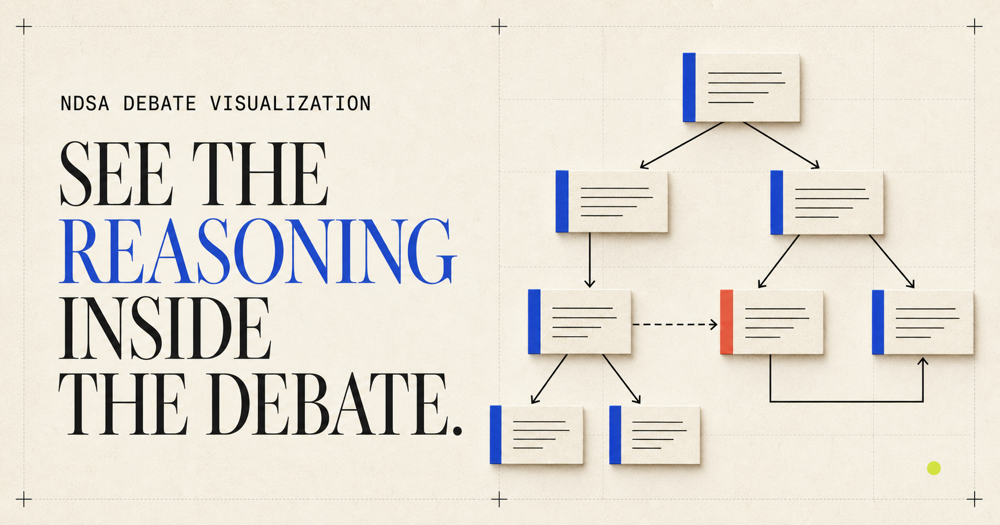

# NDSA Debate Visualization



NDSA Debate Visualization is a research prototype for exploring conflicting claims as structured arguments. It is based on Chengwei Gu’s 2021 JAIST master’s thesis, [*An Argumentation-Based Framework for Practical Reasoning*](https://dspace.jaist.ac.jp/dspace/bitstream/10119/17162/11/paper.pdf).

The proposed system turns a propositional-logic knowledge base into several complementary explanations:

- an **argument relation graph** showing arguments and attack relations;
- a **dialogical explanation** generated from dispute trees;
- a **logical explanation** that derives a claim from its premises using natural deduction;
- a **natural-language explanation** of the proof.

[Try the live visualization](https://ndsa-debate-vis.vercel.app/) · [View the project introduction](https://guchengwei.github.io/ndsa-debate-vis/) · [Read the thesis](https://dspace.jaist.ac.jp/dspace/bitstream/10119/17162/11/paper.pdf)

## Prototype status

This repository contains research-prototype code, not a production application. The Python 3.12 runtime is exercised in CI, including a real Chromium render, and the current demo is deployed on Vercel. Expect research-code limitations and defects outside the tested paths.

The landing page under [`docs/`](docs/) is a static introduction to the research. The live visualization runs separately on Vercel so the explanatory landing page and Python application remain independently deployable.

## Research use case

The thesis evaluates the method with a fragment of the second 2020 U.S. presidential debate. Statements from Donald Trump and Joe Biden are annotated as propositions, rules, and conclusions in [`data/debate_kb.csv`](data/debate_kb.csv). The example demonstrates how an inconsistent knowledge base can preserve disagreement while still supporting explicit reasoning.

## Visualization approach

The application uses a **deterministic layered argument map** rather than a force-directed graph. The focused argument is placed first, attackers are placed on the next layer, and counter-attackers continue outward. Red arrows retain the actual attack direction.

The layout is static, but inspection remains interactive: users can pan/zoom, select an argument, inspect a reduced DAG view of its generated dispute-tree paths, and open the associated natural-deduction explanation without causing graph positions to move.

The redesign deliberately reuses the existing Python/Plotly/igraph stack instead of adding a React graph editor. See [`docs/visualization-design.md`](docs/visualization-design.md) for the design rationale and a comparison with Argdown, Debate Map, OVA3, React Flow, G6, and ELK.

## Repository structure

```text
.
├── app.py                  Vercel WSGI compatibility wrapper and local launcher
├── dashboard.py            Dash interface, deterministic graph layout, and callbacks
├── argument_engine/
│   ├── argument.py         Argument construction, attacks, and extensions
│   ├── natural_deduction.py
│   ├── nd_formula.py
│   ├── nd_lookups.py
│   ├── nd_rules.py
│   └── tableaux.py
├── assets/                 Responsive Dash styles
├── data/                   Debate knowledge base and cached intermediate data
└── docs/                   Static introduction and visualization design notes
```

## Technology

- Python 3.12
- Dash and Flask
- Plotly
- igraph
- pandas

Pinned package versions are listed in [`requirements.txt`](requirements.txt).

## Local exploration

```bash
python3.12 -m venv .venv
source .venv/bin/activate
python -m pip install -r requirements.txt
python app.py
```

Before relying on the output, test the reasoning engine against known cases. Cached-data paths are resolved relative to the repository rather than a developer-specific home directory.

## Deployment

The repository has two public surfaces:

- **GitHub Pages** (`docs/`) — the static project introduction.
- **Vercel** — the live Python/Dash visualization at <https://ndsa-debate-vis.vercel.app/>.

Vercel uses the Flask-compatible `app` callable exported by root `app.py`; the full Dash application remains in `dashboard.py`.

## License

This project is available under the [MIT License](LICENSE).
